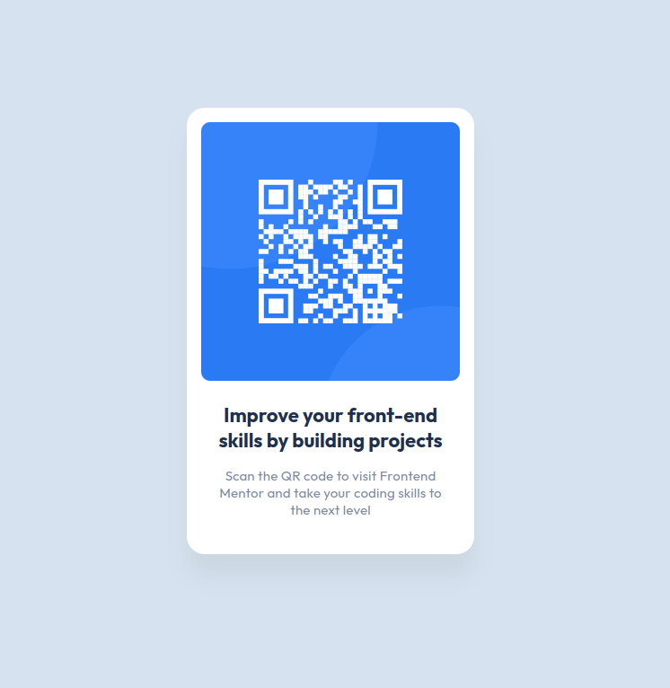

# Frontend Mentor - QR code component

This is a solution to the [QR code component challenge on Frontend Mentor](https://www.frontendmentor.io/challenges/qr-code-component-iux_sIO_H). Frontend Mentor challenges help you improve your coding skills by building realistic projects. 

## Overview

### The challenge

Users should be able to:

- View the optimal layout depending on their device's screen size

### Screenshot

### Links

- Solution URL: [https://github.com/silkcoder/qr-code-component](https://github.com/silkcoder/qr-code-component/)
- Live Site URL: [https://silkcoder.github.io/qr-code-component/](https://silkcoder.github.io/qr-code-component/)
